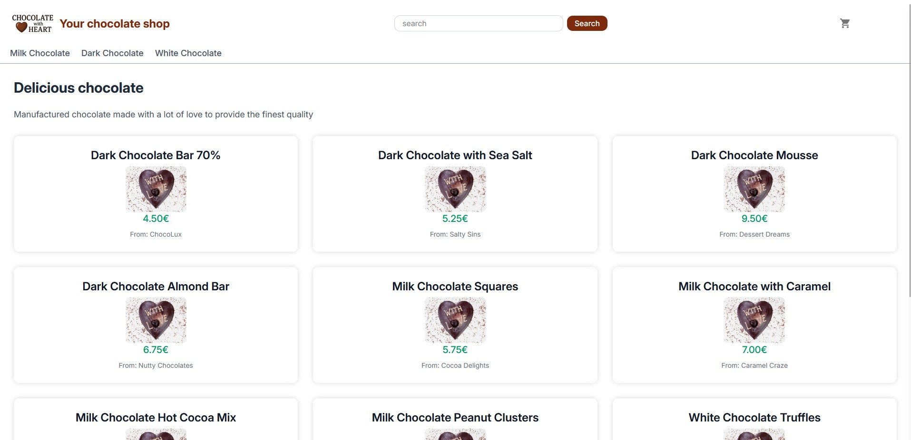
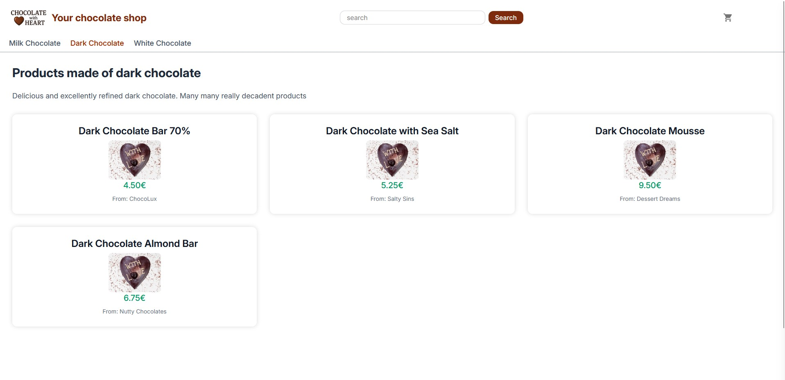
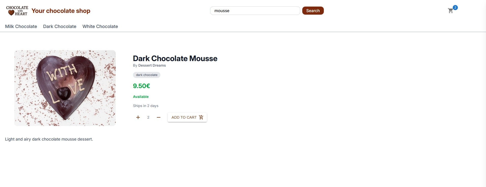
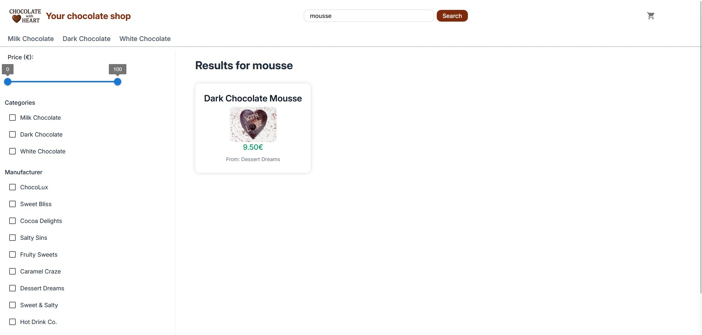
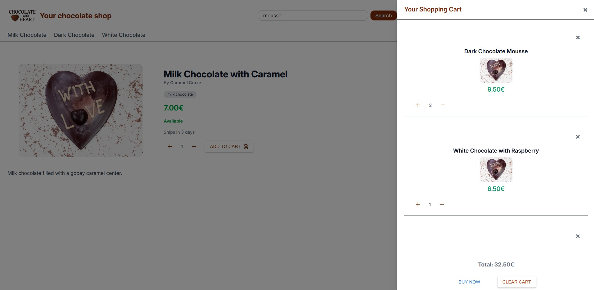

# Welcome to my chocolate webshop!

This is the frontend project. The backend can be found [here](https://github.com/Cmd190/shop-backend).
Please note that this is an experimental project which I use to practice my coding skills. It's not perfect and it't not meant to be.

Technologies: React, React Router, Typescript, Tailwind CSS.

Homepage (using placeholder images):

## Current Features:

- Pages for different categories
  
  
- Detail page for products
  
  
- Search function with different options
  
  
- Shopping cart
  
  

## Planned Features:

- Replace placeholder images
- Authentification
- different product options

## Project Structure

- --app
- ---- components: Reusable react components
- ---- routes: React router routes/subpages
- ---- root.tsx: root file bootstrapping the application
- ---- routes.ts: defines the routes for react router
